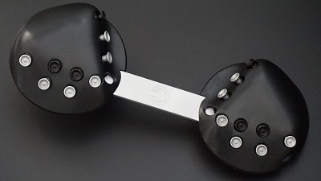

For over 20 years now I've typed with a **QWERTY** keyboard--quite successfully mind you.  According to some sources, average keyboard typing speed is around 40 wpm... which seems unbelievably slow.  "Professional" (as in the workforce doing jobs that require typing) are cited to be in the 60 wpm range.  I, a self-taught typist, type around 120-130 wpm in a 60 second test very comfortably--so I am over 2x the professional typist.

#### Enter CharaChorder

Back in November I received my CharaChorder One, which is an "alien-looking device" (as some of my coworkers have commented) that is a completely new, and, in my opinion, ***revolutionary***, device to the keyboard/typing market.

It features a unique key layout which allows you to place your hands on the keyboard and type all letters without having to move your hand much at all.  As an engineer you learn in school about how to do [time and motion studies](https://en.wikipedia.org/wiki/Time_and_motion_study), which are basically where you look at common, standard tasks that one performs and make observations about the amount of time the operator is spending doing different parts of the task and then use that knowledge to optimize it and establish standards.

When I first came across the CharaChorder on the owner's [TikTok page](https://www.tiktok.com/@rileyandrichy), I immediately started to think about how I type on my keyboard and what limits me as a typist from a time and motion perspective.  

If you too are on a QWERTY layout, I challenge you to look at how you type a paragraph and think abou the movements.  You'll quickly notice that you have to do **a lot** of movement with your fingers to get the text out.  All of that movement, each and every one, takes a bit of *time* and that is time that you could, if you optimized the layout, remove or decrease and thus optimize how much effort it takes to type and the speed at which you could type.  It's so obvious that there are ways this could be improved--like all good inventions, they seem immediately obvious and simple.

If you look at the picture of the CharaChorder One above, you can see that there a bunch of little circles that are essentially 5 way switches--meaning you can press them North, South, West, East and into the device itself (like the motion of pressing a key in on a keyboard).  So, by placing your hands on the device, you have to move each finger just a tiny bit to trigger the switch and it outputs a character, just like a keyboard would.

Think about the amount of time and effort you could save if you could master this new layout!

It was only after thinking about this for a few minutes and browsing a few more videos that I realized that the CharaChorder had **another**, not so obvious feature...which is called **chording**.

The CharaChorder (which is a portmanteau of Character and Chord), has functionality that allows you to press keys simultaneously together at the same time and output **entire words** at once!

Again, my brain immediately starts turning its gears, considering exactly what that meant and what it would imply in the time and motion study.  It's known that when you have to do actions together at the same time, this can add time because it requires coordination and skill---you want things to not require your brain, thinking, orientation, etc. However, if doing something with complex timing significantly saves time otherwise, the trade-off can be really advantageous.

And it was precisely at that point that I went to the website and immediately ordered my device and started my journey in learning about chorded text entry, alternate keyboard layouts, and all kinds of fun stuff in the typing enthusiast world.

Next time I'll write a bit about how it went--5 months later, where am I now with typing on my CharaChorder One?  What are some of the challenges of learning how to use an "alien device"?  What other kinds of devices are out there and will I be exploring any of those?